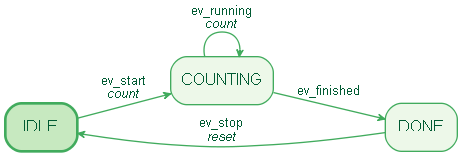
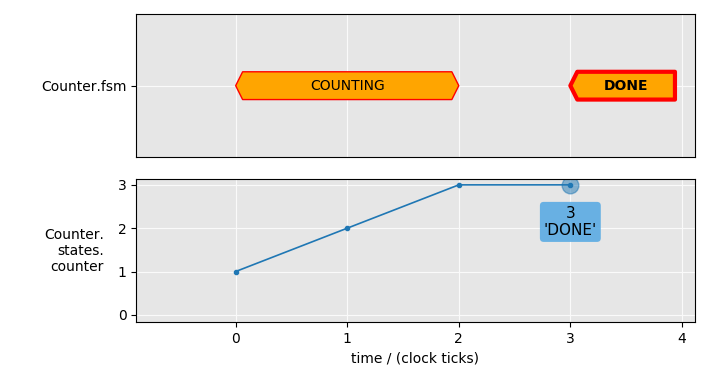
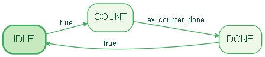
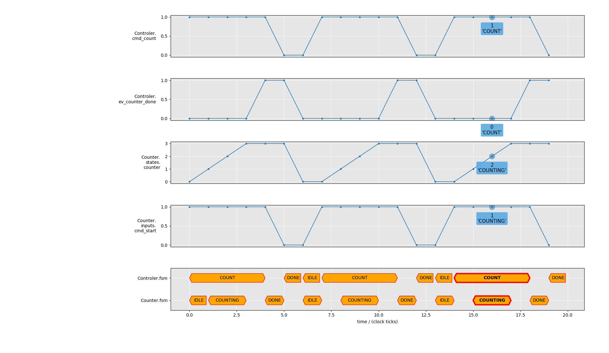

# HyFSM - Hybrid Finite State Machines in Python

HyFSM is a python tool to develop Finite State Machines (FSM) in python.
It features

* Additional discrete state variables in order to define the FSM-events and
actions while state-transitions.

* The hybrid FSMs can be organized in a hierarchical order with parent-child
relationship. In this ways the parent-FSM controls all its child-FSMs.

Example source code [ex01_ctrl-counter.py](./ex01_ctrl-counter.py)

----

## Example 1: Counter

A simple counter FSM with two inputs:

* cmd_start:    Command for starting the counter (True/False)

* limit:        maximum counting limit at which the counter stops (integer)

and one output:

* counter:      the current counter-value

Here is the definition of the counter system:

```python
class Counter(HyFSM):
    # list all input and output parameters as a comma separated string
    inputs = 'cmd_start, limit'
    outputs = 'counter'

    def __init__(self):
        super().__init__()

        # add new discrete state variable and set initial value
        self.add_state('counter', 0)

        # define FSM graph
        self.add_transition('IDLE',     self.ev_start,    'COUNTING', self.count)
        self.add_transition('COUNTING', self.ev_running,  'COUNTING', self.count)
        self.add_transition('COUNTING', self.ev_finished, 'DONE')
        self.add_transition('DONE',     self.ev_stop,     'IDLE', self.reset)

    def ev_start(self):
        return self.inputs.cmd_start.value

    def ev_stop(self):
        return not self.ev_start()

    def ev_running(self):
        return self.states['counter'] < self.inputs.limit.value

    def ev_finished(self):
        return not self.ev_running()

    # action
    def count(self):
        return {'counter': self.states['counter'] + 1}

    # action
    def reset(self):
        return {'counter': 0}

    # output
    def counter(self):
        return self.states['counter']
```

After creating an instance of the Counter-FSM we can generate the graph of the
FSM with

```python
# create Counter-FSM
counter = Counter()

counter.draw('counter_fsm_graph.png')
```



In order to see the Counter-FSM running:

```python
# configure plots
counter.plot_state('counter', row=1)
counter.plot_fsm(row=0, xlabel='')

# process an input stream
counter.run(cmd_start=[1, 1, 1, 1], limit=[3, 3, 3, 3])
```



----

## Example 2: Controller for Counter-FSM

A simple controller FSM which controls a counter as a child-FSM.

Input:

* limit:          maximum limit value for the counter

Outputs:

* cmd_count:      command for starting the child-counter-FSM
* child_counter:  counter value of child-FSM

Here is the definition of the controller system:

```python
class Controller(HyFSM):
        # list all input and output parameters as a comma separated string
        inputs = 'limit'
        outputs = 'cmd_count, child_counter'

        def __init__(self):
            super().__init__()

            # define graph of parent-FSM
            self.add_transition('IDLE', 'COUNT')
            self.add_transition('COUNT', self.ev_counter_done, 'DONE')
            self.add_transition('DONE', 'IDLE')

            # create child-FSM
            self.add_child_fsm(Counter(), name='counter')

            # connect input parameters of child-FSM
            self.counter.inputs.cmd_start.value = self.cmd_count
            self.counter.inputs.limit.value = self.inputs.limit

        def ev_counter_done(self):
            # observe states of child-FSM
            return self.counter.states['fsm'] == 'DONE'

        # output
        def cmd_count(self):
            return self.states['fsm'] == 'COUNT'

        # output
        def child_counter(self):
            return self.counter.states['counter']
```

Again, we generate the graph of the controller FSM

```python
# create Controller-FSM
ctrl = Controller()

ctrl.draw('ctrl_fsm_graph.png')
```



and process the controller-FSM with an input stream:

```python
# create Controller-FSM
ctrl = Controller()

# configure plots
ctrl.plot_func('cmd_count', row=0, xlabel='')
ctrl.plot_func('ev_counter_done', row=1, xlabel='')
ctrl.counter.plot_state('counter', row=2, xlabel='')
ctrl.counter.plot_input('cmd_start', row=3, xlabel='')
ctrl.counter.plot_fsm(row=4)
ctrl.plot_fsm(row=4)

# process an input stream with the hierachical stacked
# controller-counter-FSM
values = [3] * 20
ctrl.run(limit=values)
```



